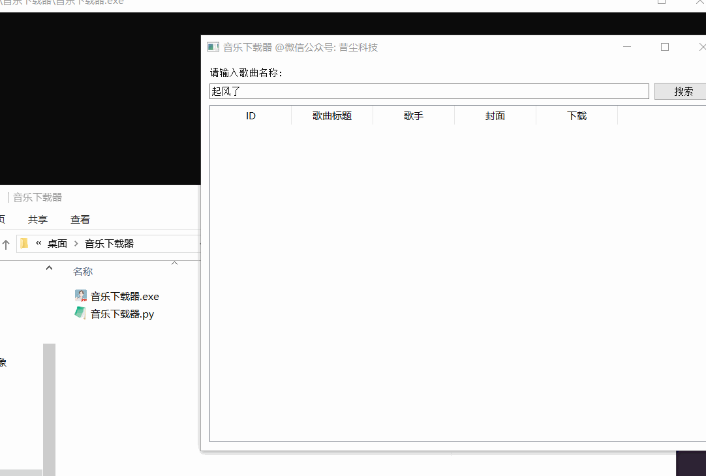

# 音乐下载器

**音乐下载器**是一款基于Python开发的简单易用应用程序。该应用采用PyQt5图形界面库开发，具有直观的用户界面和丰富的功能。

## 主要特点

- **搜索音乐**：用户可以通过输入歌曲名称，在应用中进行音乐搜索。搜索结果将以表格形式呈现，包括歌曲的ID、标题、歌手、封面图片和下载按钮。

- **显示搜索结果**：搜索结果以表格的形式展示，便于用户浏览和选择。每行的封面图片和下载按钮使得用户可以更直观地了解和操作搜索到的歌曲。

- **下载音乐**：用户可以点击下载按钮，将所选歌曲以MP3文件的形式保存到本地。下载过程会在后台进行，不会影响用户继续搜索和操作其他歌曲。

- **快速响应**：应用程序采用多线程处理网络请求和文件下载，确保用户能够快速获取搜索结果和下载音乐，提供良好的用户体验。

## 注意事项

- 请确保您的计算机已经安装了PyQt5库和requests库。

- 下载的音乐文件将保存在根目录下的`PastKing`文件夹中，请确保该文件夹存在或者有写入权限。

- 本程序已用过`pyinstaller`打包，非二次开发双击即可启动！

## 拓展

本程序的音乐源取自某平台，理论上同类型平台都可以直接替换使用。

## 赞助
如果你觉得这个项目对你有帮助，并且情况允许的话，可以给我一点点支持，总之非常感谢支持～

